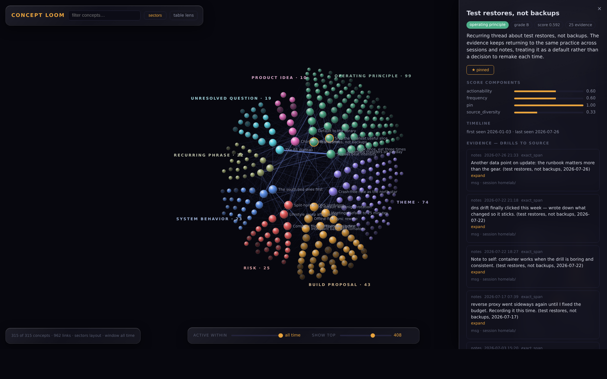

# Concept Loom

[](https://github.com/empathos/concept-loom/actions/workflows/ci.yml)


*The sectors layout on a synthetic showcase corpus (~3,000 evidence snippets → 315 concepts, 962 links), with a concept card open to its evidence trail. Concept cards are deep-linkable via `?concept=<id>`.*

Concept Loom extracts, clusters, names, and ranks the recurring concepts in
your own writing — notes, journals, chat transcripts, agent session logs —
and renders them as an explorable landscape. Every concept keeps verifiable
provenance back to the exact spans of source text it came from, and concepts
that co-occur in the same document or session are linked, so you can see how
your ideas relate.

**Semantic memory, not search**: instead of asking "where did I write X?",
Concept Loom answers "what do I keep coming back to, and how do those
threads connect?"

## How it works

```
your files ──ingest──▶ evidence ──embed──▶ vectors ──cluster──▶ clusters
 (notes, chats)      (SQLite, append-only,  (local model,       (HDBSCAN)
                       exact-span provenance) no API needed)        │
                                                                  name
                                                              (LLM titles +
                                                               summaries)
                                                                    │
      orbit UI ◀──serve── ranked concept cards ◀──rank──── named concepts
```

- **Ingest** normalizes your sources into evidence rows. Each row carries a
  provenance pointer — file path, span offsets, message id, content hash —
  that can be re-verified against the live source at any time.
- **Embed** runs a local sentence-transformers model (default `BAAI/bge-m3`);
  your text never leaves your machine for this step.
- **Cluster** groups semantically similar evidence with HDBSCAN.
- **Name** asks an LLM to title and summarize each coherent cluster. This is
  the only step that calls an external API — and it can also run against a
  local model via any OpenAI-compatible server.
- **Rank** scores concepts by frequency, source diversity, actionability,
  and pins.
- **Serve** exposes a small FastAPI backend plus the orbit UI: score-ranked
  concentric rings, force-directed graph, and attention-band layouts, with
  evidence drill-down and live provenance verification per concept.

## Quick start

Requires Python 3.12+. Embedding runs on CPU or CUDA.

```bash
git clone https://github.com/empathos/concept-loom
cd concept-loom
python3 -m venv .venv && source .venv/bin/activate
pip install -e .

cp loom.example.toml loom.toml
# edit loom.toml: point [[sources]] at your notes / transcript exports

export ANTHROPIC_API_KEY=sk-ant-...   # for the naming step (or use a local model, see below)

loom init
loom ingest        # normalize sources into evidence
loom verify        # spot-check provenance against live sources
loom embed         # local embeddings
loom cluster       # HDBSCAN over the embedding space
loom name          # LLM titles + summaries per cluster
loom rank          # score concepts
loom serve         # http://127.0.0.1:8901/static/orbit.html
```

To try it without your own data first, point the `markdown_folder` source at
`examples/sample-notes/` (see `examples/README.md`).

Re-running `loom ingest && loom embed` is incremental and cheap — unchanged
files are skipped, evidence is append-only and deduplicated. `scripts/scheduled_ingest.py`
wraps the pair for cron use, with a circuit breaker for anomalous spikes.
Re-running `loom cluster` is a full rebuild that discards existing concept
names — treat it as a supervised operation, not a scheduled one.

## Sources

Two adapters ship in the box; both track file changes and skip unchanged
files on re-ingest.

| type | what it ingests |
|---|---|
| `markdown_folder` | A folder of `.md`/`.txt` notes, chunked by paragraph with exact character spans. Chunks from the same file are linked. |
| `jsonl_transcripts` | Chat/session exports as JSON Lines, with configurable dotted paths for text, role, id, and timestamp fields — covers most assistant/agent log formats. |

Writing your own adapter is ~100 lines against a four-method interface — and
it can live entirely outside this repo as a plugin
(`type = "plugin:my_adapters:MyAdapter"`), which is the right home for
adapters that reference private systems. Custom LLM transports plug in the
same way. See [docs/writing-adapters.md](docs/writing-adapters.md).

## Naming models

`loom name` is the only network-touching step. Configure it in `[llm]`:

```toml
[llm]
provider = "anthropic"          # Anthropic API (ANTHROPIC_API_KEY)
model = "claude-opus-4-8"       # budget option: "claude-haiku-4-5"
```

or run fully local:

```toml
[llm]
provider = "openai"             # any OpenAI-compatible endpoint
model = "llama3.1"
base_url = "http://localhost:11434/v1"   # Ollama, LM Studio, vLLM, ...
```

Transport failures defer clusters for a later run instead of failing the
pipeline; incoherent clusters are marked and skipped.

## The orbit UI

`loom serve`, then open `http://127.0.0.1:8901/static/orbit.html`.

Three layouts (toggle cycles): **radial** — score-ranked concentric rings
with the strongest concepts at the center; **graph** — force-directed with
co-occurrence edges; **orbit** — percentile attention bands. Tuning sliders
for clustering pull, link visibility, sphere size, spread, dome curvature,
rotation, and ambient spin. Semantic zoom reveals weaker links and more
labels as you zoom in. Click a concept for its card: summary, evidence
drill-down, and one-click live verification of each evidence span against
the source file. Works with mouse, trackpad, and touch; installable as a
PWA (the service worker caches only the UI shell — concept data stays
network-only).

The API surface behind it: `/api/concepts`, `/api/concepts/{id}`,
`/api/concepts/{id}/evidence`, `/api/evidence/{id}/verify`, `/api/graph`,
`/api/actions/pin/{id}`.

## Privacy posture

- Evidence, embeddings, and concepts live in one local SQLite file.
- Embedding is fully local. Clustering and ranking are fully local.
- Naming sends *cluster evidence samples* (up to 12 snippets, 700 chars
  each) to your configured LLM provider — use a local model if that
  matters for your data.
- The server binds to `127.0.0.1` by default and has no auth; putting it on
  a network is on you (a tailnet works well).

## Architecture notes

See [docs/architecture.md](docs/architecture.md) for the data model
(append-only evidence, provenance pointers, concept events), the pipeline
stages, and the known limitations (re-clustering wipes naming state;
incremental clustering with stable concept identity is designed but not yet
built).

## License

MIT — see [LICENSE](LICENSE).
